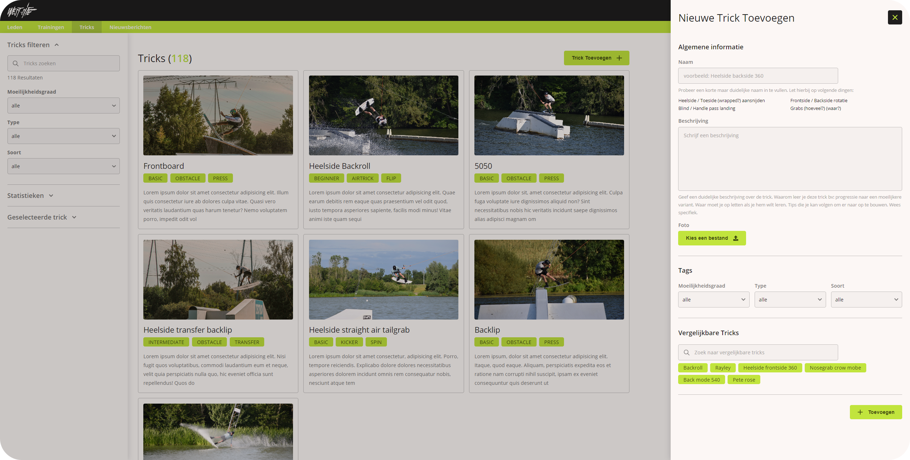

# West Site Training platform

### Technologies used

##### Frontend

-   React
-   SASS
-   Vite (**Build tool**)
-   Yup (**Object validation**)
-   Axios (**API requests**)
-   Marked (**Markdown parser**)

##### Backend

-   Express
-   Express-validator (**Object validation**)
-   MongoDB
-   Mongoose (**ORM for mongoDB**)
-   Json webtokens (**Authentication & authorization**)
-   Multer (**File uploads**)
-   Nodemon (**Hot reloading on change**)

### How to run the project

To run this project start by cloning this repo and installing all the dependencies for both the backend and the frontend.

`$ cd /client`  
`$ npm install`

`$ cd /server`  
`$ npm install`

After this is done start the express server by running `$ nodemon` in the server root directory

Then finally boot up the react app with `$ npm run dev` in the client root directory

Test user:

email: bram@gmail.com
password: Welcome2WestSiteBram
